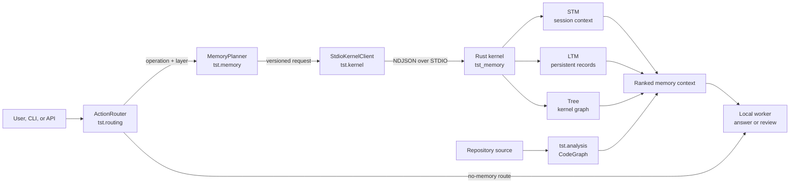

# TST Memory System

TST is a local structured-memory framework for small language models. Its Rust
kernel provides short-term memory, persistent long-term memory and a code Tree;
the Python package adds action-aware routing, canonical memory planning,
retrieval, safe repository indexing and an installed CLI.

## System at a glance



Version 0.3 keeps the same versioned newline-delimited JSON protocol while
adding a Python-owned TST Control Plane. Global and project snapshots are
separate, session context remains volatile, and the UI, MCP adapter, CLI, and
agent skills all call one `TSTService` boundary. The Rust kernel is still a
local STDIO child and is not exposed over HTTP.

## What TST is for

TST is a private, local context layer for small language models. It gives a
local assistant durable memory, temporary conversation context and structured
repository context without sending user data to a cloud memory service or
retraining the model.

Typical uses include:

- A coding assistant remembers durable preferences such as “I use TypeScript.”
- Session-only facts such as “call the service Atlas” disappear after restart.
- A repository-aware assistant retrieves symbols, callers, imports and tests
  before answering a code question.
- An agent uses explicit store, retrieve, update and forget operations instead
  of allowing model prose to mutate memory accidentally.

For example:

```text
Remember that I prefer TypeScript.
Restart TST.
Which language should we use for the frontend?
                 -> TypeScript is retrieved from persistent LTM
```

TST is not a general-purpose database, vector-search service, hosted memory
backend, desktop UI or automatic code-fix executor.

## Install and run

For a released installation, Python 3.10+ is the only prerequisite. The PyPI
package contains the Python control plane and a platform-specific Rust kernel
wheel, so users do not need a Rust toolchain:

```bash
python3 -m pipx install tst-memory
# or: uv tool install tst-memory

cd my-project
tst doctor
tst init --connect codex --connect opencode
```

`tst init` creates the project identity, indexes the repository, and installs
only the selected project-local agent files. Use `tst connect claude`,
`tst connect codex`, or `tst connect opencode` later to add an integration;
`tst disconnect <provider>` removes TST-owned files while preserving user edits.

For development or unsupported platforms, use a source checkout. The crate
uses Rust edition 2024:

```bash
python3 -m venv .venv
source .venv/bin/activate
python -m pip install --upgrade pip
python -m pip install -e .

tst doctor
tst kernel build
tst analyze .
```

Normal startup uses an existing kernel binary and never builds with Cargo
implicitly. `tst kernel build` is the explicit developer build command. A
compatible prebuilt binary can be selected with `TST_KERNEL_BIN`.

Large or native dependencies are optional:

```bash
python -m pip install -e '.[analysis]'  # Tree-sitter for JS/TS/TSX/Rust
python -m pip install -e '.[router]'    # FastAPI service
python -m pip install -e '.[models]'    # Torch/Transformers chat models

tst analyze . --symbol run_route
tst chat
```

Python repository analysis uses the standard-library AST even in a core
install. Other supported languages use a conservative fallback when the
analysis extra is absent. Scanning is root-bounded, excludes dependencies,
build output and common secrets, and never executes analyzed code.

See [installation and commands](docs/installation.md) for the complete workflow.
The release wheels target macOS arm64, macOS x86_64, Linux x86_64, Linux
arm64, and Windows x86_64. A source checkout or an external compatible server
can be used on other platforms with `TST_KERNEL_BIN`.

## Visible context layer

Initialize a repository and inspect the exact context TST would assemble:

```bash
tst init
tst context --query "implement authentication middleware" --json
tst ui
```

The local control plane stores global memory in `~/.tst/global`, project
memory in `.tst/ltm.snapshot`, and session memory in the active project kernel.
It exposes the same operations through the local API and MCP:

```bash
tst serve
tst mcp serve
tst connect claude
tst connect codex
tst connect opencode
```

After an agent is connected, TST retrieves bounded project, memory, and code
context automatically at the start of each new Codex or OpenCode user turn.
This is retrieval, not automatic memory storage. Disable it with
`TST_CONTEXT_MODE=explicit` or `TST_CONTEXT_AUTO=0`; explicit context commands
and MCP calls continue to work.

See [Control Plane](docs/control-plane.md) for scope rules, API paths, event
redaction, and integration details.

## Test

The lightweight Python CI toolchain is pinned in `requirements-dev.lock`:

```bash
python -m pip install -r requirements-dev.lock
python -m pip install --no-deps -e .
python -m pytest -m 'not integration and not protocol_contract'
python -m pytest -m protocol_contract

cargo test --locked --manifest-path tst_memory/Cargo.toml --all-targets
python -m pytest -m integration
python scripts/evaluate_routing.py
python scripts/evaluate_retrieval.py
python scripts/baseline.py
```

Pull-request CI also runs Rust formatting and Clippy, Python Ruff and mypy,
protocol fixture checks, and integration tests. Model-weight evaluations are
manual or scheduled so kernel latency remains separate from inference latency.

## Latest verified benchmark

The v0.2 release candidate was measured on 2026-08-01 on an Apple arm64 host
running macOS 26.5.2, Python 3.12.4 and Rust 1.93.1. These are local
release-kernel measurements, not guarantees for every machine.

| Operation | v0.2 target | Measured P95 |
|---|---:|---:|
| STM exact read | < 1 ms | 0.036 ms |
| LTM exact read | < 5 ms | 0.033 ms |
| Lexical memory search | < 20 ms | 1.044 ms |
| Tree symbol lookup | < 20 ms | 0.344 ms |
| Small Tree subgraph | < 50 ms | 0.135 ms |
| Snapshot save | < 250 ms | 10.732 ms |
| Protocol overhead | < 2 ms | 0.031 ms |
| Unchanged-file check | < 2 ms/file | 0.192 ms/file |

The same run measured 8.49 ms kernel startup, 3.42 ms restart and 3.84 MiB
maximum kernel RSS. All 29 Rust stress checks and every performance gate
passed. The deterministic routing set scored 100% joint operation/layer
accuracy across 300 cases with 0.018 ms P95 latency. Retrieval scored 100%
Recall@1, Recall@3 and MRR across 100 cases with 0.272 ms P95 latency, zero
wrong-memory results and zero deleted-memory leakage.

Reproduce the measured gates from a release build:

```bash
tst kernel build
python scripts/evaluate_routing.py
python scripts/evaluate_retrieval.py
python layer4_benchmarks.py test_project --with-kernel
python scripts/baseline.py --kernel-bin tst_memory/target/release/server
```

See [evaluation and regression checks](docs/evaluation.md) for methodology and
the distinction between kernel latency and model inference latency.

## Documentation

- [Getting Started](docs/getting-started.md)
- [Architecture](docs/architecture.md)
- [Protocol](docs/protocol.md)
- [Memory semantics](docs/memory-semantics.md)
- [Retrieval](docs/retrieval.md)
- [Code graph](docs/code-graph.md)
- [Structured reviews](docs/structured-reviews.md)
- [Configuration Reference](docs/configuration-reference.md)
- [Evaluation](docs/evaluation.md)
- [Installation & Commands](docs/installation.md)
- [Control Plane](docs/control-plane.md)
- [Troubleshooting](docs/troubleshooting.md)
- [Security](SECURITY.md)
- [v0.1 reproducible baseline](docs/baseline-v0.1.md)

The original system paper is available as [TST.pdf](TST.pdf).
